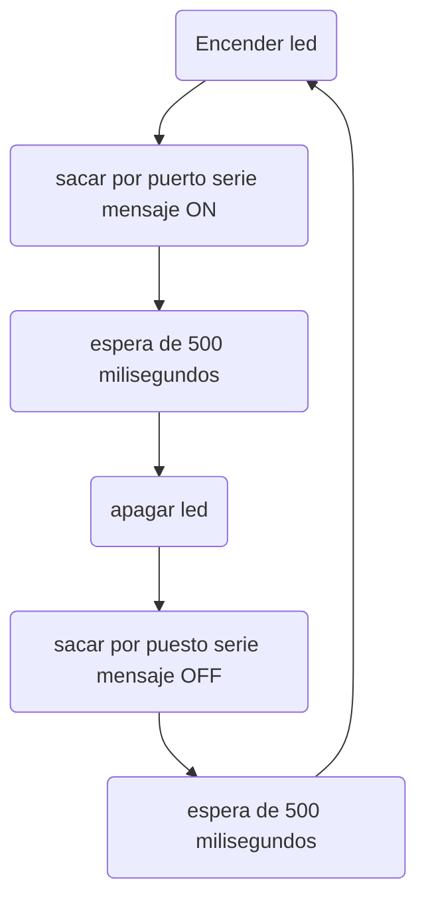

#Practica 1
##Codigo
```
#include <Arduino.h>


int led=13;
void setup() {
  // put your setup code here, to run once:
  Serial.begin(115200);
  pinMode(led, OUTPUT);
}

void loop() {
  
  Serial.println("ON");
  digitalWrite(led, HIGH);
  delay(500);
  Serial.println("OFF");
  digitalWrite(led, LOW);
    delay(500);
  // put your main code here, to run repeatedly:
}
```
##Diagrama de  flujo

##Diagrama de tiempo
```wavedrom
{ signal: [
  { name: "Led",         wave: "1010101010" },
  { name: "Tiempo",        wave: "3434343434", data: ["0.5", "0.5", "0.5", "0.5","0.5","0.5","0.5","0.5","0.5","0.5"] }
 
]}
